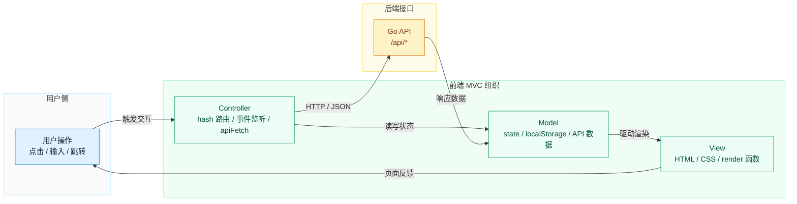
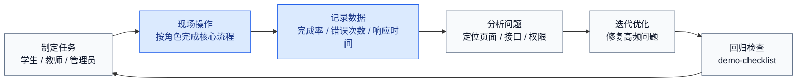
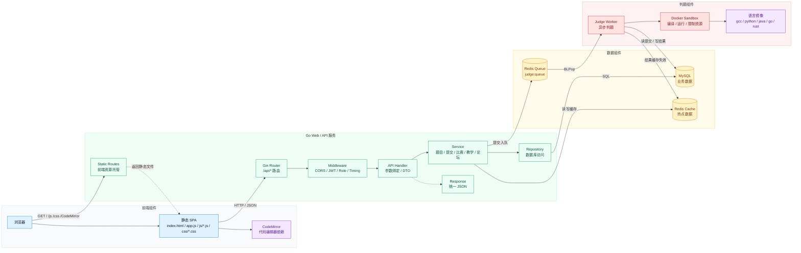
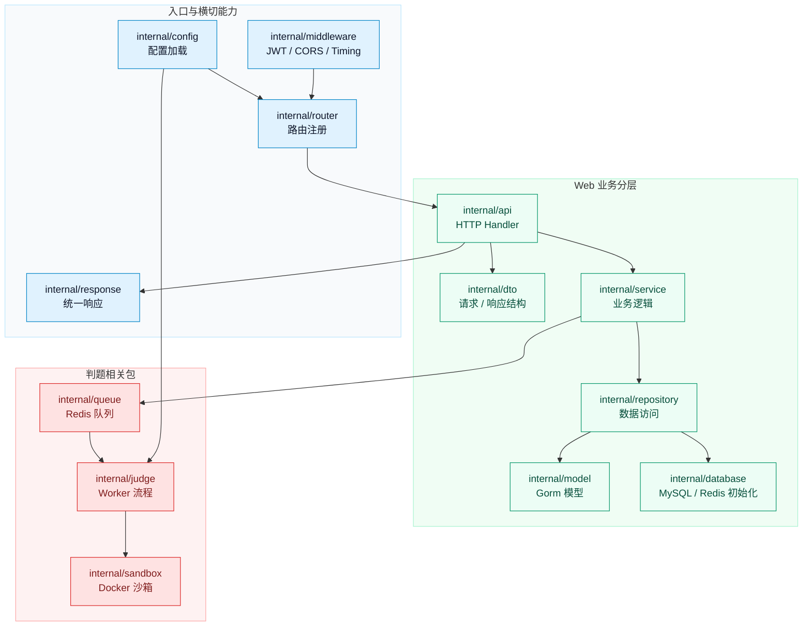
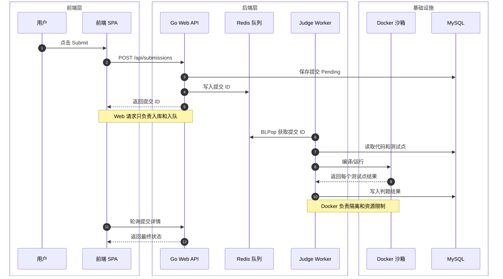

# SEU OJ 课堂汇报问题整理

本文根据当前工作区代码和已有文档整理，用于回答课堂汇报图片中的 10 个问题。内容尽量和现有实现对应，避免只停留在空泛设想。

可引用的项目依据：

- 功能现状：`docs/current-features.md`
- 需求建模：`docs/requirements-modeling.md`
- 接口文档：`docs/api.md`
- 前端结构：`seu-oj-frontend/FRONTEND_STRUCTURE.md`
- 后端路由：`seu-oj-backend/internal/router/router.go`
- 判题沙箱：`seu-oj-backend/internal/sandbox/docker_runner.go`
- 判题队列：`seu-oj-backend/internal/queue/judge_queue.go`
- Judge Worker：`seu-oj-backend/cmd/judge-worker/main.go`

## 工作内容梳理

当前项目是一个面向课程教学、日常训练、比赛组织和讨论交流的轻量级 Online Judge 系统。

已经完成或基本具备的工作包括：

- 用户与权限：注册、登录、JWT 鉴权，区分 `student`、`teacher`、`admin`。
- 题库与题解：题目列表、详情、搜索、测试点管理、题解展示与教师/管理员维护。
- 提交与判题：支持 C、C++、Python、Java、Go、Rust，包含样例运行、正式提交、提交记录和结果详情。
- 判题基础设施：提交写入数据库后进入 Redis 队列，由独立 Judge Worker 消费，并通过 Docker 沙箱编译/运行用户代码。
- 比赛模块：比赛列表、报名、比赛题目、榜单、封榜/冻结、赛后练习、比赛公告、管理员比赛管理。
- 教学模块：题单、班级、作业/考试、学生加入班级、教师管理题单/班级/作业、完成情况分析。
- 社区与内容：公告、排行榜、论坛发帖/回帖、帖子置顶/锁帖。
- 管理后台：用户管理、题目管理、比赛管理、公告管理、提交管理与重判。
- 前端结构：静态 SPA，按业务域拆分 JS/CSS，包含题库、提交、比赛、教学、论坛、管理等模块。

## Q1 是否为项目前端设计了纸质原型/线框图/高保真模型/可操作原型？

结论：当前仓库中最明确、最能展示的前端原型是“可操作原型”，即 `seu-oj-frontend` 下的静态 SPA 页面。它已经不是单纯线框，而是可以和后端 API 联调的可运行界面。

可以这样回答：

> 我们目前已经形成了可操作原型。前端使用普通 HTML、CSS、JavaScript 实现，通过 hash 路由组织页面，并按题库、提交、比赛、教学、论坛、管理后台等业务域拆分代码。页面不仅能展示静态布局，还能调用后端接口完成登录、题目浏览、代码提交、比赛报名、作业查看、论坛互动等流程。因此目前汇报时应重点展示“可操作原型”，线框图和高保真图可以作为从现有页面反推出来的设计材料。

如果老师追问有没有纸质原型或线框图，可以补充：

> 当前代码仓库没有保存独立的纸质原型文件，但我们可以基于已有页面补充线框图。线框图重点表现页面结构和交互流程，例如首页导航、题目工作台、比赛详情、教师班级页、管理后台页。高保真模型则可以直接使用当前浏览器页面截图作为展示依据。

绘制思路：

- 纸质原型：手绘 4 个核心页面即可，分别是题目列表、题目详情/代码编辑、比赛详情/榜单、教师作业管理。
- 线框图：用 draw.io、ProcessOn、Figma 或 PPT 画灰度布局，不强调颜色，重点画导航、列表、详情区、操作按钮。
- 高保真模型：直接运行系统后截取当前页面，作为真实可运行界面的高保真展示。
- 可操作原型：演示时启动后端、MySQL、Redis、Docker、Judge Worker，然后用浏览器访问 `http://127.0.0.1:8080/`。
- 注意前端代码编辑器依赖：`seu-oj-frontend/CodeMirror` 目录需要先执行 `npm install`，否则页面中通过 import map 引用的 CodeMirror 资源不会完整存在，题目详情页的代码编辑器可能加载失败。

建议展示的前端页面：

- `#/problems`：题库列表
- `#/problems/:id`：题目详情、代码编辑、Run/Submit
- `#/submissions`：我的提交
- `#/contests` 和 `#/contests/:id`：比赛与榜单
- `#/playlists`、`#/classes`、`#/teacher/classes`：教学场景
- `#/forum`：论坛
- `#/admin/problems`：管理员题目管理

## Q2 前端的 MVC 组件是什么？

结论：项目没有使用 Vue/React/Angular 这类严格 MVC/MVVM 框架，但当前前端可以按“轻量 MVC”理解：`state` 和后端 API 数据是 Model，HTML/CSS 与渲染函数是 View，hash 路由、事件监听和接口调用函数是 Controller。

| MVC 层 | 当前项目对应内容 | 代码位置 |
|---|---|---|
| Model | 全局 `state`、`localStorage` 中的 token/user、后端 API 返回的 DTO 数据 | `seu-oj-frontend/app.js`、后端 `internal/dto` |
| View | `index.html` 页面壳、各 CSS 文件、各 `render*` 函数生成的 DOM | `index.html`、`css/*.css`、`js/*.js` |
| Controller | `renderRoute()` 路由分发、表单提交事件、按钮点击事件、`apiFetch()` 请求封装 | `app.js`、`js/problems.js`、`js/contests.js` 等 |

可以这样回答：

> 我们的前端不是传统框架式 MVC，而是原生 JavaScript SPA。Model 主要是全局状态和后端接口数据，View 是 HTML/CSS 以及按页面拆分的渲染函数，Controller 是 hash 路由、事件处理和 API 调用逻辑。比如用户点击 Submit 后，Controller 收集语言和代码并调用 `/api/submissions`；后端返回提交 ID 后更新 Model；View 再通过轮询提交详情刷新判题结果。

前端模块拆分：

- 公共入口：`app.js`、`js/bootstrap.js`
- 通用页面：`js/general-pages.js`
- 题库与题目工作台：`js/problems.js`、`css/problem.css`
- 提交与结果详情：`js/submissions.js`、`css/submission.css`
- 比赛：`js/contests.js`、`css/contest.css`
- 教学：`js/teaching.js`、`css/teaching.css`
- 管理后台：`js/admin.js`
- 论坛：`js/forum.js`、`css/forum.css`
- 全局样式：`styles.css`、`css/base.css`

绘制思路：

- 画三层 MVC 矩形。
- 左侧写用户操作，例如“点击提交”“切换比赛榜单”“教师发布作业”。
- 中间 Controller 写 `renderRoute`、事件监听、`apiFetch`。
- 下方 Model 写 `state`、`localStorage`、API DTO。
- 右侧 View 写 `index.html`、CSS、`render*` 页面函数。

Mermaid 示例：



## Q3 评估/测试项目用户体验的计划是什么？

结论：建议采用“任务驱动测试 + 角色走查 + 指标记录”的方式，而不是只看页面是否能打开。

测试对象按角色划分：

| 角色 | 重点测试任务 |
|---|---|
| 游客 | 浏览题库、查看题目、查看公告、查看比赛榜单、浏览论坛 |
| 学生 | 注册/登录、提交代码、查看判题结果、报名比赛、完成作业、发帖/回帖 |
| 教师 | 创建题单、创建班级、发布作业/考试、查看完成情况、维护题解 |
| 管理员 | 管理题目、比赛、公告、用户、提交与重判 |

用户体验测试计划：

1. 核心路径走查：按“登录 -> 做题 -> 提交 -> 查看结果 -> 参加比赛 -> 查看榜单 -> 完成作业”执行完整流程。
2. 可用性测试：邀请组员或同学按指定任务操作，记录是否能在无说明情况下完成。
3. 错误场景测试：测试未登录访问、权限不足、错误密码、空表单、代码编译错误、超时、运行时错误。
4. 响应体验测试：记录题目列表、题目详情、提交详情、比赛榜单的加载时间，观察是否出现明显卡顿。
5. 前端稳定性检查：查看浏览器 Console 是否出现红色错误，检查不同页面跳转后是否有空白页。
6. 演示前回归：使用 `docs/demo-checklist.md` 逐项检查。

建议记录的指标：

- 任务完成率：用户是否完成指定任务。
- 操作步数：完成任务需要点击多少次。
- 错误次数：用户是否误点、迷路、提交失败。
- 首次理解时间：用户是否能快速判断下一步该点哪里。
- 接口响应时间：可以结合后端 `Server-Timing` 响应头和日志。
- 主观评分：可以使用简化版 1-5 分满意度，或使用 SUS 问卷。

可以这样回答：

> 我们的用户体验测试会围绕真实任务，而不是只检查页面外观。学生侧重点是能不能顺利做题、提交、查看结果；教师侧重点是能不能顺利管理题单、班级和作业；管理员侧重点是能不能完成题目、比赛、公告和用户维护。每次测试记录任务完成率、错误次数、页面响应时间和用户主观反馈，再根据问题优先优化主链路。

用户体验测试流程图可以这样画：



## Q4 项目的组件图是怎样的？

结论：组件图应突出“前端 SPA、后端 API 服务、判题队列、Judge Worker、Docker 沙箱、MySQL、Redis”之间的关系。

核心组件：

- Browser/Frontend SPA：页面展示、用户交互、调用 API。
- Go Web Server：Gin 路由、静态资源托管、鉴权、业务 API。
- API Handler：处理 HTTP 请求和参数绑定。
- Service：业务逻辑，例如题目、提交、比赛、教学、论坛。
- Repository：数据库读写封装。
- MySQL：持久化用户、题目、提交、比赛、教学、论坛等数据。
- Redis Cache/Queue：缓存热点数据，同时作为判题任务队列。
- Judge Worker：独立进程，消费 Redis 队列中的提交任务。
- Docker Sandbox Runner：编译和运行用户代码，并限制资源。

可以这样回答：

> 我们的组件图可以分为四组：第一组是前端 SPA，负责页面、代码编辑器和交互；第二组是 Go Web/API 服务，负责静态资源托管、路由、中间件、参数处理和统一响应；第三组是数据组件，包括 MySQL 和 Redis 缓存/队列；第四组是判题组件，包括 Judge Worker、Docker 沙箱和语言镜像。正式提交不会在 Web 请求里同步完成判题，而是先入库、入队，再由 Worker 异步处理并写回结果。

绘制思路：

- 从左到右画：前端 SPA -> Go Web/API -> MySQL/Redis -> Judge Worker/Docker。
- 在 Go Web/API 内部分层画：静态资源托管、Router、Middleware、Handler、Service、Repository、DTO/Response。
- Redis 同时画成缓存和判题队列，突出它的双重职责。
- Judge Worker 连接 Redis 队列、MySQL、Docker 沙箱，表示异步判题闭环。
- 用实线表示主调用链路，用虚线表示静态资源或辅助依赖。

Mermaid 示例：



## Q5 项目的部署图是怎样的？

结论：当前适合展示为课程原型部署：浏览器访问 Go Web 服务，Go 服务连接 MySQL 和 Redis；Judge Worker 独立运行，从 Redis 获取判题任务并调用 Docker 执行用户代码。

当前运行方式：

- MySQL：保存业务数据。
- Redis：保存缓存和判题队列。
- Docker：提供代码执行隔离环境。
- CodeMirror 前端依赖：进入 `seu-oj-frontend/CodeMirror` 执行 `npm install`，安装代码编辑器依赖包。
- Web 服务：在 `seu-oj-backend` 下执行 `go run .`。
- Judge Worker：在 `seu-oj-backend` 下执行 `go run ./cmd/judge-worker`。
- 浏览器：访问 `http://127.0.0.1:8080/`。

部署/演示前建议命令：

```powershell
cd "D:\desk\软件工程\SEUOJ\seu-oj-frontend\CodeMirror"
npm install

cd "D:\desk\软件工程\SEUOJ\seu-oj-backend"
go run .

cd "D:\desk\软件工程\SEUOJ\seu-oj-backend"
go run ./cmd/judge-worker
```

可以这样回答：

> 部署上我们把 Web 服务和判题 Worker 分开。Web 服务负责对外提供页面和 API，Judge Worker 专门处理耗时且有风险的代码执行。MySQL 负责持久化，Redis 负责缓存和判题任务队列，Docker 负责隔离用户代码。前端代码编辑器使用 CodeMirror，因此部署时还需要在 `seu-oj-frontend/CodeMirror` 下执行 `npm install` 安装静态依赖。这样的部署方式比把所有逻辑塞进一个进程更清晰，也方便后续扩展多个 Worker。

绘制思路：

- 使用 UML Deployment Diagram 或普通网络拓扑图。
- 节点包括：用户浏览器、应用服务器、MySQL、Redis、Docker Host。
- 应用服务器里放两个进程：`seu-oj-backend` 和 `judge-worker`。
- Docker Host 下画多个短生命周期容器：compile/run container。
- 标注端口：Web `8080`，MySQL `3306`，Redis `6379`。

Mermaid 示例：



```mermaid
flowchart TB
  Client["用户浏览器"] -->|HTTP :8080| Web

  subgraph AppServer["应用服务器 / 本地演示环境"]
    Web["Go Web 服务<br/>seu-oj-backend"]
    Worker["Judge Worker<br/>cmd/judge-worker"]
    Docker["Docker Engine"]
  end

  subgraph Data["数据服务"]
    MySQL[(MySQL<br/>:3306)]
    Redis[(Redis<br/>:6379)]
  end

  subgraph FrontendDeps["前端静态依赖"]
    CodeMirror["CodeMirror node_modules<br/>npm install"]
  end

  subgraph Containers["短生命周期判题容器"]
    C1["Compile Container"]
    C2["Run Container"]
  end

  Web -->|SQL| MySQL
  Web -->|Cache / Queue| Redis
  Web -.->|加载静态资源| CodeMirror
  Worker -->|SQL| MySQL
  Worker -->|BLPop Queue| Redis
  Worker -->|创建容器| Docker
  Docker --> C1 --> C2

  classDef client fill:#E0F2FE,stroke:#0284C7,color:#0F172A;
  classDef app fill:#ECFDF5,stroke:#059669,color:#064E3B;
  classDef data fill:#FEF3C7,stroke:#D97706,color:#78350F;
  classDef docker fill:#FEE2E2,stroke:#DC2626,color:#7F1D1D;
  classDef deps fill:#F3E8FF,stroke:#7E22CE,color:#581C87;
  class Client client;
  class Web,Worker app;
  class MySQL,Redis data;
  class Docker,C1,C2 docker;
  class CodeMirror deps;
  style AppServer fill:#F0FDF4,stroke:#A7F3D0,stroke-width:1px;
  style Data fill:#FFFBEB,stroke:#FCD34D,stroke-width:1px;
  style FrontendDeps fill:#FAF5FF,stroke:#D8B4FE,stroke-width:1px;
  style Containers fill:#FEF2F2,stroke:#FCA5A5,stroke-width:1px;
```

## Q6 项目的包图是怎样的？

结论：包图可以分成后端包图和前端模块图。后端按照 Go package 分层，前端按照业务域拆分 JS/CSS。

后端主要包：

| 包/目录 | 职责 |
|---|---|
| `cmd/judge-worker` | 判题 worker 入口 |
| `internal/router` | Gin 路由注册、静态资源托管 |
| `internal/api` | HTTP Handler |
| `internal/service` | 业务逻辑 |
| `internal/repository` | 数据访问封装 |
| `internal/model` | Gorm 数据模型 |
| `internal/dto` | 请求/响应结构 |
| `internal/middleware` | CORS、JWT、管理员/教师权限、Timing |
| `internal/database` | MySQL、Redis 初始化 |
| `internal/cache` | Redis JSON 缓存封装 |
| `internal/queue` | Redis 判题队列 |
| `internal/judge` | Worker 判题流程 |
| `internal/sandbox` | Docker 编译运行沙箱 |
| `internal/config` | 配置加载和环境变量覆盖 |
| `internal/response` | 统一 JSON 响应 |

前端主要模块：

| 文件/目录 | 职责 |
|---|---|
| `index.html` | 页面壳、导航、脚本样式装配 |
| `app.js` | 全局状态、路由、通用工具、登录注册等核心逻辑 |
| `js/bootstrap.js` | 应用启动和浏览器事件绑定 |
| `js/problems.js` | 题库、题目详情、代码编辑、题解 |
| `js/submissions.js` | 提交列表、提交详情、轮询 |
| `js/contests.js` | 比赛、榜单、公告、比赛管理 |
| `js/teaching.js` | 题单、班级、作业、教师页面 |
| `js/admin.js` | 管理员题目/用户/公告/提交管理 |
| `js/forum.js` | 论坛主题、回帖、管理 |
| `css/*.css` | 全局样式和分业务域样式 |

可以这样回答：

> 后端包图体现的是典型分层：router 接入请求，api 处理 HTTP，service 组织业务逻辑，repository 访问数据库，model 和 dto 表达数据结构；判题相关的 queue、judge、sandbox 单独成包，避免和普通 Web 业务混在一起。前端包图则按业务域拆分，题目、提交、比赛、教学、论坛、管理后台都有独立 JS/CSS，方便多人协作。

绘制思路：

- 后端包图从上到下画 `router -> api -> service -> repository -> model/database`。
- 旁边单独画 `queue -> judge -> sandbox`，并连接到 `service`、`Redis`、`Docker`。
- 前端包图画 `app.js` 作为核心壳，周围连接各业务 JS 模块和 CSS 模块。

Mermaid 示例：



## Q7 是否有使用虚拟化技术的计划？

结论：已经使用了 Docker 作为判题沙箱，这是项目中最关键的虚拟化/容器化技术。后续计划可以从“判题隔离”和“整体部署容器化”两个方向说明。

当前已经具备：

- Docker 容器编译和运行用户代码。
- 编译镜像和运行镜像可配置。
- 支持多语言默认镜像：`gcc:13`、`python:3`、`eclipse-temurin:21`、`golang:1`、`rust:1`。
- 限制网络：`--network none`。
- 限制 CPU：`--cpus`。
- 限制内存：`--memory`、`--memory-swap`。
- 限制进程数：`--pids-limit`。
- 限制文件大小、输出大小和编译输出大小。
- 使用非 root 用户运行：默认 `65534:65534`。
- 可开启只读根文件系统：`--read-only`。
- 使用临时目录和 `tmpfs`。

可以这样回答：

> 我们已经在判题环节使用 Docker 容器作为沙箱。因为 OJ 系统要运行用户提交的任意代码，如果直接在宿主机执行风险很高，所以我们通过容器隔离运行环境，并设置 CPU、内存、进程数、网络、文件大小和输出大小限制。后续如果要部署到服务器，可以进一步使用 Docker Compose 把 Web、Worker、MySQL、Redis 统一编排起来。

后续虚拟化计划：

1. 使用 Docker Compose 管理 `web`、`judge-worker`、`mysql`、`redis`。
2. 为 Web 服务和 Worker 构建固定版本镜像，减少“本机能跑、服务器不能跑”的问题。
3. 判题 Worker 支持水平扩展，按提交量启动多个 Worker 容器。
4. 语言镜像提前拉取和预热，减少首次提交的镜像拉取等待。
5. 生产环境中进一步引入只读挂载、独立网络、资源配额和日志收集。

## Q8 项目中是否存在潜在安全风险？如何降低？

结论：存在安全风险，尤其是任意代码执行、权限控制、输入输出内容、接口滥用和配置泄漏。当前项目已经在判题沙箱、JWT 和角色中间件上做了基础控制，但后续仍需补充更严格的安全策略和测试。

| 风险 | 影响 | 当前已有措施 | 后续改进 |
|---|---|---|---|
| 用户任意代码执行 | 可能攻击宿主机或消耗资源 | Docker 沙箱、禁网、非 root、CPU/内存/进程/输出限制 | 更细粒度 seccomp/apparmor、容器运行用户隔离、判题节点独立部署 |
| 权限越权 | 学生访问教师/管理员能力 | JWT 鉴权、`RequireAdmin`、`RequireTeacherOrAdmin` | 为关键接口补权限测试和审计日志 |
| SQL 注入 | 数据泄漏或篡改 | Gorm 参数化查询为主 | 检查原生 SQL，避免拼接用户输入 |
| XSS | 论坛/题解/题面内容注入脚本 | 前端部分内容使用转义函数 | Markdown 渲染加入白名单过滤，所有用户内容统一 sanitize |
| 提交刷量/DoS | 队列堆积、Worker 被占满 | Redis 队列可观察长度 | 增加用户级限流、IP 限流、比赛高峰限流 |
| Token 泄漏 | 账号被冒用 | Bearer token 鉴权 | 缩短 token 有效期、HTTPS、避免第三方脚本、可加入刷新机制 |
| CORS 过宽 | 被非预期站点调用接口 | 当前允许 `*` | 部署时改成指定域名 |
| 配置泄漏 | 数据库密码、JWT Secret 泄漏 | 支持环境变量覆盖 | 生产环境禁用默认 secret，敏感配置不入库 |
| 题目测试点泄漏 | 影响比赛公平性 | 普通题目详情只展示公开信息 | 检查管理员接口权限和响应字段 |

可以这样回答：

> OJ 最大的安全风险是运行用户提交的任意代码。我们没有直接在宿主机运行代码，而是通过 Docker 沙箱并关闭网络、限制资源、使用非 root 用户运行。第二类风险是权限越权，所以后端用 JWT 和角色中间件区分学生、教师、管理员。第三类风险来自论坛、题解、题面等用户内容，后续需要继续加强 XSS 过滤和权限测试。

优先改进顺序：

1. 给权限边界补自动化测试。
2. 对 Markdown/论坛内容做统一 sanitize。
3. 部署时收紧 CORS 和 JWT Secret。
4. 给提交接口加限流。
5. 将判题 Worker 部署在独立节点或更受限的容器环境中。

## Q9 未来产品的峰值需求/容量将是多少？

结论：当前没有真实生产压测数据，因此汇报时应说明这是“课程/校园场景下的容量估算”，并给出可扩展公式。容量瓶颈主要不是普通页面访问，而是判题 Worker 的吞吐量。

建议的阶段性容量目标：

| 阶段 | 用户规模 | 峰值在线 | 活跃提交 | 目标 |
|---|---:|---:|---:|---|
| 课程演示/小组测试 | 20-50 人 | 10-20 人 | 20-100 次/小时 | 单机可演示完整链路 |
| 单门课程使用 | 100-300 人 | 50-100 人 | 300-600 次/小时 | 1 个 Web 服务 + 1-3 个 Worker |
| 多班级/校内试用 | 500-1000 人 | 100-300 人 | 1000-3000 次/小时 | 多 Worker、缓存、数据库索引优化 |

判题容量估算公式：

```text
每小时判题能力 ≈ Worker 数量 × 3600 / 单次提交平均判题耗时（秒）
```

例如：

- 如果一次提交平均耗时 6 秒，1 个 Worker 理论上约 600 次/小时。
- 3 个 Worker 理论上约 1800 次/小时。
- 实际还要考虑 Docker 启动、编译时间、测试点数量、机器资源和高峰抖动，所以汇报时不要只报理论上限。

可以这样回答：

> 我们预计课程级使用的峰值在线人数在 50-100 人左右，比赛或作业截止前提交会集中出现，目标先支持每小时数百次提交。未来如果扩展到多班级试用，主要通过增加 Judge Worker 数量提升判题吞吐，而普通页面访问可以通过 Redis 缓存、分页和数据库索引支撑。最终容量需要通过压测校准，当前给出的是阶段性估算。

后续压测计划：

- 用脚本模拟题目列表、题目详情、登录、提交查询等 API。
- 单独压测提交入队速度和 Worker 消费速度。
- 记录 MySQL 慢查询、Redis 队列长度、Docker 运行耗时。
- 根据队列堆积情况决定 Worker 扩容数量。

## Q10 基于潜在需求/容量，是否存在性能瓶颈？如何改进？

结论：存在潜在瓶颈，主要集中在判题沙箱启动与执行、Redis 队列消费能力、比赛榜单/统计查询、数据库索引、前端大列表渲染和轮询频率。

主要瓶颈和改进方案：

| 瓶颈 | 原因 | 改进方向 |
|---|---|---|
| Docker 判题耗时 | 每次提交都要编译/运行，容器启动和测试点执行成本高 | 多 Worker 横向扩展、镜像预拉取、限制测试点数量、缓存编译结果可作为后续方向 |
| 单 Worker 消费能力有限 | 当前 Worker 独立消费 Redis 队列，数量不足时会堆积 | 支持多个 Worker 同时消费队列，按队列长度自动扩容 |
| 比赛榜单查询 | 比赛高峰时提交多，榜单统计复杂 | Redis 缓存榜单、增量更新、分页展示、只在必要时刷新 |
| 数据库压力 | 提交、结果、榜单、统计都依赖 MySQL | 给 `user_id`、`problem_id`、`contest_id`、`status`、时间字段加索引，优化慢查询 |
| 前端轮询 | 提交详情和比赛页面可能频繁请求 | 控制轮询间隔，提交完成后停止轮询，后续可考虑 SSE/WebSocket |
| 前端大 DOM | 榜单、提交列表、论坛列表过大时渲染慢 | 分页、虚拟列表、减少一次性渲染行数 |
| 缓存一致性 | 缓存能提速，但更新后可能不一致 | 明确缓存 key 前缀和失效策略，关键写操作后删除相关缓存 |

当前已有的性能基础：

- Redis 缓存封装：`internal/cache/cache.go`
- Redis 判题队列：`internal/queue/judge_queue.go`
- 后端 Timing 中间件：`internal/middleware/timing.go`
- 前端提交详情轮询在完成后会停止
- 比赛榜单和列表已有分页/局部刷新思路

可以这样回答：

> 未来性能瓶颈主要会出现在判题链路，而不是普通页面访问。因为一次提交可能涉及编译、多个测试点运行、数据库写入和结果回传。我们的改进思路是先把 Web 服务和判题 Worker 解耦，再通过增加 Worker 数量扩展判题能力；同时对榜单、题目、统计等读多写少数据使用 Redis 缓存，对提交和榜单查询补数据库索引。前端方面则控制轮询频率并使用分页减少渲染压力。

优先级建议：

1. 先做可观测性：记录接口耗时、判题耗时、队列长度、慢查询。
2. 再做低成本优化：索引、分页、缓存、轮询停止。
3. 最后做扩展能力：多 Worker、容器化部署、榜单增量计算。

## 汇报时建议主动展示的图

建议至少准备 3 张图：

1. 前端 MVC/模块图：回答 Q2。
2. 系统组件图：回答 Q4。
3. 部署图：回答 Q5。

如果时间允许，再补充：

- 后端包图：回答 Q6。
- 判题流程时序图：支撑 Q7、Q8、Q10。
- 用户体验测试流程图：支撑 Q3。

判题流程图绘制思路：



## 现场回答总述

可以用下面这段作为整组问题的开场：

> 我们的 SEU OJ 目前已经从需求建模进入可运行原型阶段。前端是原生 HTML/CSS/JS 的 SPA，后端是 Go + Gin + Gorm 分层服务，数据层使用 MySQL，判题任务通过 Redis 队列交给独立 Judge Worker，并使用 Docker 沙箱执行用户代码。汇报中的前端原型、MVC、组件图、部署图、包图、安全风险、容量和性能瓶颈，都可以围绕这条主链路展开说明。
