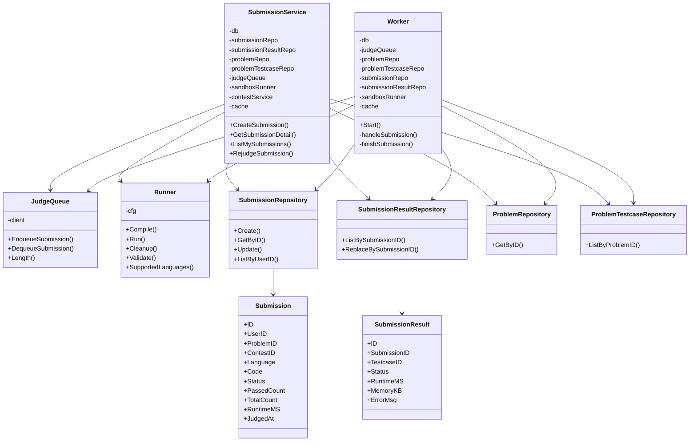
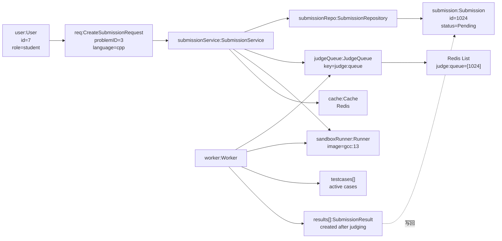
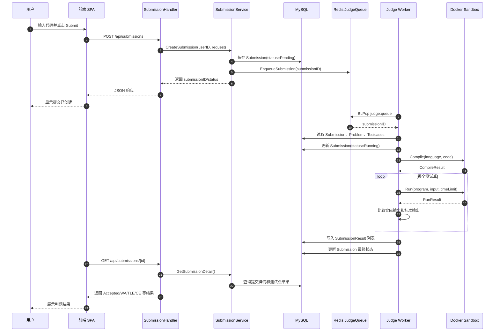

# SEU OJ 新汇报问题回答整理

本文用于回答课堂投影中的 10 个问题。内容基于当前 SEUOJ 仓库的实际实现，包括 Go 后端、静态前端、MySQL、Redis、Docker 判题沙箱和现有文档。

可引用的项目依据：

- 后端入口：`seu-oj-backend/main.go`
- 路由装配：`seu-oj-backend/internal/router/router.go`
- 提交服务：`seu-oj-backend/internal/service/submission_service.go`
- 判题 Worker：`seu-oj-backend/internal/judge/worker.go`
- Docker 沙箱：`seu-oj-backend/internal/sandbox/docker_runner.go`
- Redis 判题队列：`seu-oj-backend/internal/queue/judge_queue.go`
- 前端入口：`seu-oj-frontend/index.html`、`seu-oj-frontend/app.js`
- 前端业务模块：`seu-oj-frontend/js/*.js`、`seu-oj-frontend/css/*.css`
- 接口文档：`docs/api.md`
- 需求建模：`docs/requirements-modeling.md`

## 项目一句话介绍

SEU OJ 是一个面向课程教学、日常训练、比赛组织和社区讨论的 Online Judge 系统。前端使用静态 HTML/CSS/JavaScript 实现 SPA，后端使用 Go + Gin + Gorm 提供 API，数据存储使用 MySQL，缓存和判题队列使用 Redis，用户代码通过 Docker 沙箱编译和运行。

---

## Q1 你的项目中使用了哪种 IDE？

推荐回答：

> 我们开发时主要使用 VS Code 作为通用 IDE/编辑器。它适合这个项目的原因是同时支持 Go、JavaScript、HTML、CSS、Markdown、Git 和终端集成，能够覆盖后端开发、前端开发、文档编写和调试运行。部分成员也可以根据个人习惯使用 GoLand、WebStorm 或 IntelliJ IDEA，但项目本身不绑定某个 IDE，只依赖标准的 Git、Go、Node/npm、MySQL、Redis 和 Docker 环境。

可以补充：

- 后端 Go 代码：使用 Go 插件完成格式化、跳转定义、错误提示。
- 前端静态页面：使用 HTML/CSS/JS 插件和浏览器 DevTools 调试。
- 文档：使用 Markdown 预览编辑 `docs` 下材料。
- 联调：使用 IDE 内置终端运行 `go run .`、`go test ./...`、`npm install` 等命令。

一句话总结：

> IDE 主要提升开发效率，但项目没有强依赖某个 IDE，换成其他支持 Go 和 Web 开发的工具也能继续维护。

---

## Q2 你的项目中是否使用了高级 IDE？

结论：使用了现代 IDE 能力，但没有把项目架构绑定到某个商业高级 IDE 上。

推荐回答：

> 我们使用了现代 IDE 的高级能力，例如 Go 语言服务、自动补全、跳转定义、格式化、静态检查、Git 集成、Markdown 预览和内置终端。这些能力帮助我们在后端分层、前端模块拆分、接口文档维护和多人协作时降低错误率。但我们没有使用只能在特定 IDE 中运行的项目配置，保证项目可以在 VS Code、GoLand 或命令行环境中运行。

具体使用到的高级能力：

| 能力 | 在项目中的作用 |
|---|---|
| 代码补全和跳转定义 | 快速定位 `api -> service -> repository -> model` 调用链 |
| 自动格式化 | 保持 Go、JS、CSS、Markdown 风格统一 |
| Git 集成 | 查看修改、比较差异、处理多人协作 |
| 内置终端 | 启动 Go 服务、Judge Worker、执行测试 |
| 调试/日志查看 | 排查 API、判题队列和 Docker 沙箱问题 |
| Markdown 预览 | 编写需求建模、接口文档、答辩材料 |

注意口径：

> 如果老师把“高级 IDE”理解为 GoLand、IntelliJ IDEA 这类专业 IDE，可以说：项目可以使用 GoLand 等高级 IDE 进一步提升 Go 后端开发体验，但当前实现并不依赖高级 IDE 的专有能力。

---

## Q3 你是否在项目中使用了任何现有的包或组件？

结论：使用了。项目使用了多个成熟开源包和基础组件，避免从零重复实现 Web 框架、ORM、JWT、Redis 客户端、Docker 运行环境和代码编辑器。

主要后端包：

| 包/组件 | 用途 |
|---|---|
| `github.com/gin-gonic/gin` | Web 框架、路由、中间件、HTTP 请求处理 |
| `gorm.io/gorm`、`gorm.io/driver/mysql` | ORM 和 MySQL 数据访问 |
| `github.com/go-sql-driver/mysql` | MySQL 驱动 |
| `github.com/redis/go-redis/v9` | Redis 客户端，用于缓存和判题队列 |
| `github.com/golang-jwt/jwt/v5` | JWT 登录鉴权 |
| `golang.org/x/crypto` | 密码哈希等安全能力 |
| `github.com/goccy/go-yaml` | 读取 YAML 配置 |

主要基础设施组件：

| 组件 | 用途 |
|---|---|
| MySQL | 持久化用户、题目、提交、比赛、论坛、教学数据 |
| Redis | 缓存热点数据，维护 `judge:queue` 判题队列 |
| Docker | 编译和运行用户提交代码，提供隔离环境 |
| CodeMirror | 前端代码编辑器，提升做题页面的编辑体验 |

推荐回答：

> 我们没有从零手写所有底层能力，而是使用了成熟的开源包和组件。比如 Gin 负责 HTTP 路由，Gorm 负责数据库访问，go-redis 负责 Redis 缓存和队列，JWT 包负责身份令牌，Docker 负责判题隔离，CodeMirror 负责前端代码编辑器。这些组件让我们可以把主要精力放在 OJ 业务逻辑上。

---

## Q4 使用这些框架或组件的好处是什么？

推荐回答：

> 使用现有框架和组件的好处主要有四点：第一，减少重复造轮子，提高开发效率；第二，成熟组件经过更多使用场景验证，稳定性和安全性更高；第三，社区资料丰富，遇到问题更容易定位；第四，框架本身提供清晰边界，方便项目分层和后续扩展。

分组件说明：

| 框架/组件 | 好处 |
|---|---|
| Gin | 路由清晰，中间件机制方便接入 CORS、JWT、Timing |
| Gorm | 简化 CRUD、分页、事务和模型映射 |
| MySQL | 关系型数据适合用户、题目、提交、比赛等结构化数据 |
| Redis | 缓存提升查询性能，队列支持异步判题 |
| Docker | 隔离用户代码，限制 CPU、内存、网络、进程数和输出大小 |
| CodeMirror | 提供更接近真实 IDE 的代码编辑体验 |
| JWT | 前后端分离场景下便于实现无状态鉴权 |

结合本项目的例子：

> 例如提交代码时，Web 请求不直接同步判题，而是把提交保存到 MySQL 后写入 Redis 队列；独立 Judge Worker 再从队列取任务，并使用 Docker 沙箱执行代码。这种组合让 Web 服务响应更快，也把危险的用户代码执行隔离到了沙箱中。

---

## Q5 你项目的类图是什么样的？

说明：Go 语言没有传统 Java/C++ 意义上的 class，但有 `struct`、方法和包。汇报时可以把核心结构体当作类图来展示。

推荐回答：

> 我们项目的核心类图围绕提交判题链路展开。用户通过前端提交代码，后端的 `SubmissionHandler` 调用 `SubmissionService`，服务层通过 `SubmissionRepository` 写入提交记录，并通过 `JudgeQueue` 放入 Redis 队列。`JudgeWorker` 消费队列后读取题目和测试点，调用 `SandboxRunner` 在 Docker 中编译运行，最后把 `Submission` 和 `SubmissionResult` 写回数据库。

核心类/结构体：

- `SubmissionService`：提交业务逻辑，负责创建提交、查询提交、重判、缓存失效。
- `JudgeQueue`：封装 Redis 队列，提供入队、出队和长度查询。
- `Worker`：判题 worker，负责消费队列并处理提交。
- `Runner`：Docker 沙箱运行器，负责编译、运行和清理临时目录。
- `SubmissionRepository`：提交表的数据访问。
- `SubmissionResultRepository`：测试点结果的数据访问。
- `ProblemRepository`：题目数据访问。
- `ProblemTestcaseRepository`：测试点数据访问。
- `Submission`：提交实体。
- `SubmissionResult`：单个测试点结果实体。

类图草图：


```mermaid
classDiagram
  class SubmissionService {
    -db
    -submissionRepo
    -submissionResultRepo
    -problemRepo
    -problemTestcaseRepo
    -judgeQueue
    -sandboxRunner
    -contestService
    -cache
    +CreateSubmission()
    +GetSubmissionDetail()
    +ListMySubmissions()
    +RejudgeSubmission()
  }

  class JudgeQueue {
    -client
    +EnqueueSubmission()
    +DequeueSubmission()
    +Length()
  }

  class Worker {
    -db
    -judgeQueue
    -problemRepo
    -problemTestcaseRepo
    -submissionRepo
    -submissionResultRepo
    -sandboxRunner
    -cache
    +Start()
    -handleSubmission()
    -finishSubmission()
  }

  class Runner {
    -cfg
    +Compile()
    +Run()
    +Cleanup()
    +Validate()
    +SupportedLanguages()
  }

  class SubmissionRepository {
    +Create()
    +GetByID()
    +Update()
    +ListByUserID()
  }

  class SubmissionResultRepository {
    +ListBySubmissionID()
    +ReplaceBySubmissionID()
  }

  class ProblemRepository {
    +GetByID()
  }

  class ProblemTestcaseRepository {
    +ListByProblemID()
  }

  class Submission {
    +ID
    +UserID
    +ProblemID
    +ContestID
    +Language
    +Code
    +Status
    +PassedCount
    +TotalCount
    +RuntimeMS
    +JudgedAt
  }

  class SubmissionResult {
    +ID
    +SubmissionID
    +TestcaseID
    +Status
    +RuntimeMS
    +MemoryKB
    +ErrorMsg
  }

  SubmissionService --> SubmissionRepository
  SubmissionService --> SubmissionResultRepository
  SubmissionService --> ProblemRepository
  SubmissionService --> ProblemTestcaseRepository
  SubmissionService --> JudgeQueue
  SubmissionService --> Runner
  Worker --> JudgeQueue
  Worker --> SubmissionRepository
  Worker --> SubmissionResultRepository
  Worker --> ProblemRepository
  Worker --> ProblemTestcaseRepository
  Worker --> Runner
  SubmissionRepository --> Submission
  SubmissionResultRepository --> SubmissionResult
```

---

## Q6 你项目的对象图是什么样的？

说明：对象图展示的是系统运行时某一瞬间的对象实例和它们之间的关系。建议用“一次提交正在等待判题”的场景来画。

推荐回答：

> 对象图可以选择一次用户提交作为快照。此时前端有一个当前登录用户对象和提交请求对象；后端有一个 `SubmissionService` 实例，它持有多个 Repository、JudgeQueue、SandboxRunner 和 Cache；数据库里有一个 `Submission#1024` 记录，状态是 `Pending`；Redis 队列里也有提交 ID `1024`；Judge Worker 之后会取出这个 ID 并生成多个 `SubmissionResult` 对象。

对象图草图：


```mermaid
flowchart LR
  UserObj["user:User<br/>id=7<br/>role=student"]
  ReqObj["req:CreateSubmissionRequest<br/>problemID=3<br/>language=cpp"]
  ServiceObj["submissionService:SubmissionService"]
  RepoObj["submissionRepo:SubmissionRepository"]
  QueueObj["judgeQueue:JudgeQueue<br/>key=judge:queue"]
  RunnerObj["sandboxRunner:Runner<br/>image=gcc:13"]
  CacheObj["cache:Cache<br/>Redis"]
  SubmissionObj["submission:Submission<br/>id=1024<br/>status=Pending"]
  RedisObj["Redis List<br/>judge:queue=[1024]"]
  WorkerObj["worker:Worker"]
  TestcaseObj["testcases[]<br/>active cases"]
  ResultObj["results[]:SubmissionResult<br/>created after judging"]

  UserObj --> ReqObj
  ReqObj --> ServiceObj
  ServiceObj --> RepoObj
  ServiceObj --> QueueObj
  ServiceObj --> RunnerObj
  ServiceObj --> CacheObj
  RepoObj --> SubmissionObj
  QueueObj --> RedisObj
  WorkerObj --> QueueObj
  WorkerObj --> RunnerObj
  WorkerObj --> TestcaseObj
  WorkerObj --> ResultObj
  ResultObj -.写回.-> SubmissionObj
```

可以现场解释：

> 对象图强调运行时实例。类图回答“有哪些类型”，对象图回答“某一刻这些类型实例化成了什么对象，以及对象之间如何关联”。

---

## Q7 你项目的顺序图是什么样的？

推荐回答：

> 顺序图最适合展示用户提交代码到得到判题结果的全过程。这个流程不是同步完成的：前端提交代码后，后端先保存提交记录并写入 Redis 队列，然后立即返回提交 ID；Judge Worker 异步消费队列，用 Docker 沙箱编译运行代码，最后写回数据库。前端通过查询提交详情看到最终结果。

提交判题顺序图：


```mermaid
sequenceDiagram
  autonumber
  participant U as 用户
  participant F as 前端 SPA
  participant API as SubmissionHandler
  participant S as SubmissionService
  participant DB as MySQL
  participant Q as Redis JudgeQueue
  participant W as Judge Worker
  participant D as Docker Sandbox

  U->>F: 输入代码并点击 Submit
  F->>API: POST /api/submissions
  API->>S: CreateSubmission(userID, request)
  S->>DB: 保存 Submission(status=Pending)
  S->>Q: EnqueueSubmission(submissionID)
  S-->>API: 返回 submissionID/status
  API-->>F: JSON 响应
  F-->>U: 显示提交已创建

  W->>Q: BLPop judge:queue
  Q-->>W: submissionID
  W->>DB: 读取 Submission、Problem、Testcases
  W->>DB: 更新 Submission(status=Running)
  W->>D: Compile(language, code)
  D-->>W: CompileResult
  loop 每个测试点
    W->>D: Run(program, input, timeLimit)
    D-->>W: RunResult
    W->>W: 比较实际输出和标准输出
  end
  W->>DB: 写入 SubmissionResult 列表
  W->>DB: 更新 Submission 最终状态
  F->>API: GET /api/submissions/{id}
  API->>S: GetSubmissionDetail()
  S->>DB: 查询提交详情和测试点结果
  API-->>F: 返回 Accepted/WA/TLE/CE 等结果
  F-->>U: 展示判题结果
```

如果时间不够，可以简化为：

```text
前端提交代码 -> Web API 保存提交 -> Redis 入队 -> Worker 出队 -> Docker 编译运行 -> MySQL 写回结果 -> 前端查询结果
```

---

## Q8 你的项目中是否使用了任何设计模式？

结论：使用了多种常见工程模式，但不是为了堆概念，而是为了解耦、可测试和可扩展。

推荐回答：

> 项目中使用了分层架构、Repository 模式、DTO 模式、中间件模式、生产者-消费者模式、依赖注入思想和模板/策略式语言配置。它们分别解决了路由处理、业务逻辑、数据库访问、鉴权、异步判题和多语言沙箱运行的问题。

设计模式/架构模式对应表：

| 模式 | 项目中的体现 | 作用 |
|---|---|---|
| 分层架构 | `router -> api -> service -> repository -> model` | 拆分 HTTP、业务、数据访问职责 |
| Repository 模式 | `internal/repository/*` | 封装数据库操作，避免服务层直接散落 SQL |
| DTO 模式 | `internal/dto/*` | 区分接口请求/响应和数据库模型 |
| Middleware 模式 | `internal/middleware/*` | 统一处理 CORS、JWT、角色权限、Timing |
| 生产者-消费者模式 | Web 服务入队，Judge Worker 出队 | 解耦提交请求和耗时判题 |
| 依赖注入思想 | `router.New()` 中装配 service/repository/queue/runner | 让模块依赖更清晰，便于替换和测试 |
| 策略/配置化思想 | `Runner.specFor(language)` 和 sandbox config | 不同语言使用不同编译/运行命令 |
| Cache-Aside 模式 | `cache.GetOrSet()` 和写操作后失效缓存 | 提升读性能并控制缓存一致性 |

重点解释的两个模式：

1. 生产者-消费者模式：
   - Web API 是生产者，创建提交后把提交 ID 写入 Redis。
   - Judge Worker 是消费者，从 Redis 队列取出提交 ID。
   - 好处是 Web 请求不会被判题耗时阻塞，也方便后续增加多个 Worker。

2. 分层架构：
   - Handler 只负责 HTTP 参数和响应。
   - Service 负责业务规则。
   - Repository 负责数据库访问。
   - Model/DTO 负责数据表达。
   - 好处是修改某一层时不会影响整个系统。

---

## Q9 你将来如何处理组件变更或功能扩展？

推荐回答：

> 后续处理组件变更和功能扩展时，我们会遵循“保持接口稳定、模块内部演进、先扩展后替换”的原则。具体来说，前端按业务域扩展页面，后端按 `api/service/repository/model/dto` 的分层增加模块；对于判题、缓存、数据库这类基础组件，通过接口封装和配置项降低替换成本。

扩展策略：

| 扩展方向 | 处理方式 |
|---|---|
| 新增业务模块 | 新增对应 `api`、`service`、`dto`、必要的 `model/repository` |
| 新增前端页面 | 在 `seu-oj-frontend/js` 和 `css` 下按业务域拆分，不继续堆到单个文件 |
| 新增编程语言 | 在 `sandbox.Runner.specFor()` 中增加语言编译/运行配置，并准备 Docker 镜像 |
| 增加判题能力 | 启动更多 Judge Worker，共享 Redis 队列 |
| 更换缓存策略 | 保持 service 层调用缓存封装，不把 Redis 细节散落到业务代码 |
| 数据库字段变化 | 先补 SQL/模型/DTO，再更新 service 和前端展示 |
| 权限扩展 | 在 middleware 中统一增加角色或权限检查，不在各处写重复判断 |

建议的变更流程：

1. 先明确变更影响范围：前端、接口、数据库、判题还是权限。
2. 更新接口文档和数据结构。
3. 小步提交代码，优先保持旧功能可运行。
4. 给关键路径补测试或至少做回归清单。
5. 变更完成后清理过时入口和文档。

可以现场举例：

> 例如以后要支持 JavaScript 判题，不需要改整个系统，只需要在沙箱语言配置中增加源文件名、编译命令或运行命令、默认 Docker 镜像，然后前端语言下拉框和后端校验同步增加即可。

---

## Q10 随着项目迭代，你如何处理遗留代码？

推荐回答：

> 处理遗留代码时，我们不会一上来大规模重写，而是先识别风险和重复，再围绕业务边界逐步重构。对于仍在运行的旧代码，优先补文档、补测试、补接口约束；对于已经被新模块替代的代码，再逐步删除，避免影响现有功能。

处理原则：

| 原则 | 说明 |
|---|---|
| 不盲目重写 | 先判断旧代码是否真的影响维护、性能或安全 |
| 先覆盖关键路径 | 对登录、提交、判题、比赛榜单、权限接口优先做回归 |
| 小步重构 | 每次只调整一个模块或一条调用链 |
| 保持接口兼容 | 前端依赖的 API 不随意改名或改响应结构 |
| 删除前先确认无引用 | 通过搜索、编译、测试和手动演示确认旧入口不用了 |
| 文档同步 | 代码变更后更新 `docs/api.md`、答辩材料和运行说明 |

当前项目中的具体做法：

- 前端已经按业务域拆分：题目、提交、比赛、教学、论坛、管理分别放在不同 JS/CSS 文件中，减少单文件遗留代码继续膨胀。
- 后端已经按 `api/service/repository/model/dto` 分层，便于逐步替换某个模块而不影响全部功能。
- 判题逻辑已经从 Web 请求中拆到独立 Worker，减少后续演进时的耦合。
- 缓存、队列、沙箱都有独立包，未来替换实现时可以优先保持外部调用方式不变。

推荐现场回答：

> 对遗留代码我们会采用渐进式治理。短期内先保证它可运行、可理解、可回归；中期把重复逻辑抽到公共 service、middleware 或工具包；长期删除无引用代码，保持文档、接口和测试同步。这样比一次性重写更适合课程项目，也更能控制风险。

---

## 现场总括回答

如果需要用一段话串起全部问题，可以这样说：

> 我们的 SEU OJ 项目使用 VS Code 等现代 IDE 进行开发，借助 Go、Gin、Gorm、MySQL、Redis、Docker 和 CodeMirror 等成熟组件完成一个可运行的在线评测系统。系统采用分层架构，前端按业务域拆分，后端按 router、api、service、repository、model、dto 分层，判题链路通过 Redis 队列和独立 Worker 解耦，并用 Docker 沙箱隔离用户代码。后续扩展时，我们会保持接口稳定、模块化新增功能；处理遗留代码时，会以小步重构、回归验证和文档同步为原则。
